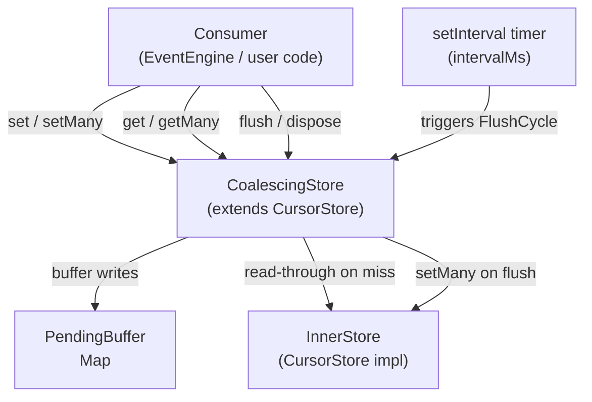

# Design Document: coalesce-cursor-store

## Overview

`coalesceCursorStore` is a write-coalescing decorator for any `CursorStore` implementation in `@orbital-stellar/pulse-core`. High-throughput Stellar event engines call `set` after every processed event; stores like Postgres and S3 charge per write, making per-event persistence expensive. The wrapper buffers all writes in an in-memory `Map` (the PendingBuffer) and drains it to the underlying store on a configurable `setInterval` timer, reducing N writes per interval to at most one `setMany` call.

The wrapper is transparent to callers — it extends `CursorStore` and overrides all four read/write methods — and adds two lifecycle methods: `flush()` for graceful shutdown and `dispose()` to cancel the background timer. The maximum data-loss window on an unclean exit is bounded by `intervalMs`.

### Key Design Decisions

- **Extends `CursorStore`** rather than wrapping it behind a separate interface, so it is a drop-in replacement anywhere a `CursorStore` is accepted.
- **`PendingBuffer` is a `Map<string, string>`** — O(1) reads and writes, natural last-write-wins semantics on repeated `set` calls for the same key.
- **`setInterval` for the periodic timer** — straightforward, well-understood, and cancellable with `clearInterval`. The timer handle is stored as a private field.
- **`flushInProgress` promise chain** — a single `Promise` field that is replaced on each flush. Both the scheduled timer callback and the manual `flush()` method chain onto this promise, ensuring at most one `setMany` call is in flight at a time and that concurrent callers serialize correctly.
- **`dispose()` is synchronous** — it calls `clearInterval` and does not flush; callers who want a clean shutdown must call `flush()` first.

---

## Architecture



The `CoalescingStore` sits between the consumer and the `InnerStore`. All writes land in the `PendingBuffer` first. Reads check the buffer before delegating to the `InnerStore`. The timer fires every `intervalMs` milliseconds and drains the buffer via a single `InnerStore.setMany` call.

---

## Components and Interfaces

### `CoalescingStoreOptions`

```typescript
export interface CoalescingStoreOptions {
  /** Maximum milliseconds between automatic FlushCycles. Must be a positive finite integer. */
  intervalMs: number;
}
```

### `CoalescingStore` class

```typescript
export class CoalescingStore extends CursorStore {
  // --- Public API ---
  get(streamKey: string): Promise<string | null>
  set(streamKey: string, cursor: string): Promise<void>
  getMany(keys: string[]): Promise<Record<string, string | null>>
  setMany(entries: Record<string, string>): Promise<void>
  flush(): Promise<void>
  dispose(): void
}
```

### `coalesceCursorStore` factory function

```typescript
export function coalesceCursorStore(
  inner: CursorStore,
  options: CoalescingStoreOptions
): CoalescingStore
```

The factory validates `options.intervalMs`, constructs the `CoalescingStore`, and returns it. Validation is done in the factory (not the constructor) to keep the class testable in isolation.

### Internal state

| Field | Type | Purpose |
|---|---|---|
| `#inner` | `CursorStore` | The delegate store for durable writes and read fall-through |
| `#buffer` | `Map<string, string>` | PendingBuffer — in-memory cursor values not yet flushed |
| `#timer` | `ReturnType<typeof setInterval>` | Handle for the recurring flush timer |
| `#flushInProgress` | `Promise<void>` | Serialization chain; new flushes append to this promise |

---

## Data Models

### PendingBuffer

```
PendingBuffer: Map<string, string>
  key   → StreamKey  (opaque string, e.g. Stellar account address)
  value → cursor     (opaque string, e.g. Horizon paging token)
```

The buffer holds at most one cursor per stream key at any time. A subsequent `set` for the same key overwrites the previous value — this is the coalescing behaviour. The buffer is drained (cleared) atomically at the start of each flush cycle: the current entries are snapshotted into a plain object, the buffer is cleared, and then `InnerStore.setMany` is called with the snapshot. This ensures that writes arriving during the async `setMany` call are not lost.

### Flush serialization chain

```
#flushInProgress: Promise<void>
```

Initialized to `Promise.resolve()`. Every flush (scheduled or manual) is implemented as:

```typescript
this.#flushInProgress = this.#flushInProgress.then(() => this.#doFlush());
```

This guarantees that concurrent flush calls are serialized — each waits for the previous to complete before starting. The manual `flush()` method returns the new tail of the chain so callers can `await` it.

### Snapshot-then-clear pattern

```
snapshot = Object.fromEntries(this.#buffer)
this.#buffer.clear()
await this.#inner.setMany(snapshot)
```

Clearing the buffer *before* the async `setMany` call means new writes that arrive during the I/O operation accumulate in the now-empty buffer and will be picked up by the next flush cycle. This prevents data loss under concurrent writes.

---

## Correctness Properties

*A property is a characteristic or behavior that should hold true across all valid executions of a system — essentially, a formal statement about what the system should do. Properties serve as the bridge between human-readable specifications and machine-verifiable correctness guarantees.*

### Property 1: Invalid intervalMs throws RangeError

*For any* `intervalMs` value that is less than or equal to zero, or is not a finite number (NaN, Infinity, -Infinity), `coalesceCursorStore` SHALL throw a `RangeError`.

**Validates: Requirements 1.2, 1.3**

---

### Property 2: set buffers without touching InnerStore

*For any* stream key and cursor value, calling `CoalescingStore.set(streamKey, cursor)` SHALL store the value in the PendingBuffer and SHALL NOT invoke any method on the InnerStore.

**Validates: Requirements 2.1**

---

### Property 3: Last-write-wins coalescing

*For any* stream key and non-empty sequence of cursor values, after calling `set(streamKey, v)` for each value `v` in the sequence, `get(streamKey)` SHALL return the last value in the sequence, and a subsequent `flush()` SHALL call `InnerStore.setMany` with exactly that last value for the key.

**Validates: Requirements 2.2, 3.4**

---

### Property 4: setMany buffers all entries without touching InnerStore

*For any* non-empty entries map, calling `CoalescingStore.setMany(entries)` SHALL merge all entries into the PendingBuffer and SHALL NOT invoke any method on the InnerStore.

**Validates: Requirements 2.3**

---

### Property 5: flush drains the buffer to InnerStore exactly once

*For any* non-empty set of buffered entries, calling `flush()` SHALL invoke `InnerStore.setMany` exactly once with all buffered entries, and the PendingBuffer SHALL be empty after `flush()` resolves.

**Validates: Requirements 3.2, 4.1**

---

### Property 6: get serves buffered values without delegating to InnerStore

*For any* stream key that has a value in the PendingBuffer, `get(streamKey)` SHALL return the buffered value and SHALL NOT call `InnerStore.get`.

**Validates: Requirements 5.1**

---

### Property 7: get delegates to InnerStore for keys absent from the buffer

*For any* stream key that is not present in the PendingBuffer, `get(streamKey)` SHALL call `InnerStore.get(streamKey)` exactly once and return its result.

**Validates: Requirements 5.2**

---

### Property 8: getMany splits reads between buffer and InnerStore

*For any* set of keys where a subset is present in the PendingBuffer and the remainder is not, `getMany(keys)` SHALL return buffered values for the buffered subset, delegate only the non-buffered keys to `InnerStore.getMany`, and merge the results into a single record with no key omitted.

**Validates: Requirements 5.3**

---

### Property 9: Concurrent flush serialization — each entry written exactly once

*For any* set of entries buffered before a flush, when `flush()` is called concurrently with a scheduled FlushCycle, each entry SHALL appear in `InnerStore.setMany` exactly once across all calls — no entry is duplicated and no entry is silently dropped.

**Validates: Requirements 4.3**

---

## Error Handling

### Factory validation

`coalesceCursorStore` validates `intervalMs` before constructing the store:

```typescript
if (!Number.isFinite(options.intervalMs) || options.intervalMs <= 0) {
  throw new RangeError(
    `coalesceCursorStore: intervalMs must be a positive finite number, got ${options.intervalMs}`
  );
}
```

This covers `NaN`, `Infinity`, `-Infinity`, `0`, and negative values in a single check.

### InnerStore errors

Errors thrown by `InnerStore.setMany` during a flush cycle propagate through the `#flushInProgress` promise chain. Because the buffer is cleared *before* the `setMany` call, a failed flush will lose the entries that were in the snapshot. Callers who need retry semantics should implement them in the `InnerStore` adapter (e.g., `PostgresCursorStore` can retry on transient connection errors). The `CoalescingStore` does not attempt to re-buffer failed entries — doing so would complicate the concurrency model and could cause unbounded memory growth.

If `InnerStore.setMany` rejects, the rejection propagates to:
- The `flush()` caller (if the flush was triggered manually), allowing them to handle or log it.
- The scheduled timer callback (if triggered automatically) — the rejection is unhandled unless the consumer attaches a `.catch` to the `#flushInProgress` chain. A future enhancement could accept an `onError` callback in `CoalescingStoreOptions`.

### dispose() after flush()

Calling `dispose()` after `flush()` is safe — `clearInterval` on an already-cleared handle is a no-op in Node.js. Calling `flush()` after `dispose()` is also safe — the buffer is drained normally; the timer simply won't fire again.

---

## Testing Strategy

The test suite uses **Vitest** as the test runner and **fast-check** for property-based tests, matching the existing patterns in `test/PostgresCursorStore.pbt.test.ts` and `test/RedisCursorStore.pbt.test.ts`.

### Test files

| File | Purpose |
|---|---|
| `test/CoalescingStore.test.ts` | Example-based unit tests (factory validation, timer lifecycle, dispose behaviour) |
| `test/CoalescingStore.pbt.test.ts` | Property-based tests for all 9 correctness properties |

### Fake InnerStore

All tests use a lightweight in-memory `FakeInnerStore` that records every call to `get`, `set`, `getMany`, and `setMany`. This avoids any I/O and makes call-count assertions straightforward.

```typescript
class FakeInnerStore extends CursorStore {
  readonly store = new Map<string, string>();
  readonly setManyCalls: Array<Record<string, string>> = [];
  readonly getManyCalls: Array<string[]> = [];
  readonly getCalls: string[] = [];

  async get(key: string) { this.getCalls.push(key); return this.store.get(key) ?? null; }
  async set(key: string, value: string) { this.store.set(key, value); }
  async getMany(keys: string[]) {
    this.getManyCalls.push(keys);
    const result: Record<string, string | null> = {};
    for (const k of keys) result[k] = this.store.get(k) ?? null;
    return result;
  }
  async setMany(entries: Record<string, string>) {
    this.setManyCalls.push({ ...entries });
    for (const [k, v] of Object.entries(entries)) this.store.set(k, v);
  }
}
```

### Timer control

Unit tests that exercise the periodic timer use **Vitest fake timers** (`vi.useFakeTimers()` / `vi.advanceTimersByTimeAsync()`). Property-based tests call `flush()` directly to avoid timer complexity in the PBT harness.

### Property test configuration

Each property-based test runs with `{ numRuns: 100 }` and is tagged with a comment referencing the design property:

```typescript
// Feature: coalesce-cursor-store, Property N: <property text>
```

### Unit test coverage targets

- Factory throws `RangeError` for `intervalMs <= 0` and non-finite values (examples: `0`, `-1`, `NaN`, `Infinity`)
- Timer fires after `intervalMs` and calls `InnerStore.setMany` with buffered entries
- Timer does not fire after `dispose()`
- `dispose()` with buffered entries does not flush
- `flush()` on empty buffer does not call `InnerStore.setMany`
- `flush()` resolves after `InnerStore.setMany` completes

### Dual testing approach

Unit tests cover specific examples, edge cases, and timer lifecycle. Property tests verify universal correctness across randomly generated inputs. Together they provide comprehensive coverage: unit tests catch concrete regressions, property tests verify general invariants across the full input space.
