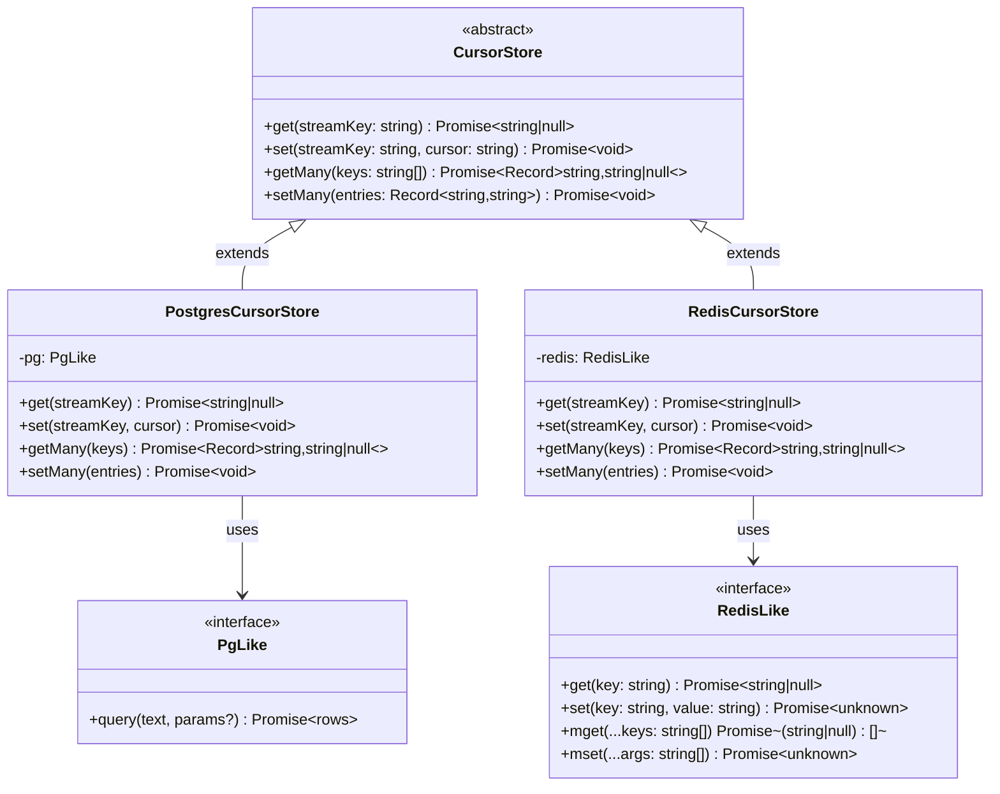

# Design Document: cursor-store-batch-operations

## Overview

This feature extends the `CursorStore` abstraction in `@orbital-stellar/pulse-core` with optional batch methods — `getMany` and `setMany` — that allow multi-source engines to read and write N cursors in a single network or database round-trip instead of N sequential calls.

The design follows three principles:

1. **Backward compatibility**: existing adapters that only implement `get` / `set` continue to work unchanged. The base class provides default implementations that delegate to the single-key methods.
2. **Opt-in efficiency**: adapters that can batch (Postgres, Redis) override the batch methods with a single-query implementation.
3. **Minimal surface area**: the `RedisLike` injection interface is kept as small as possible so any Redis client (`ioredis`, `node-redis`, etc.) can be used without wrapping.

### Key Research Findings

**PostgreSQL batch upsert pattern** — A multi-row `INSERT … ON CONFLICT DO UPDATE` with unnested arrays is the idiomatic single-query upsert in `pg`. Using `unnest($1::text[], $2::text[])` keeps the query parameterized and avoids dynamic SQL construction. This is consistent with the existing single-row upsert in `PostgresCursorStore.set`.

**Redis MGET / MSET** — `MGET key [key …]` returns an ordered list of values (or `null` for missing keys) in one round-trip. `MSET key value [key value …]` writes all pairs atomically in one round-trip. Both are available in every Redis client that exposes a `RedisLike`-compatible interface.

**Abstract class vs interface** — The current `CursorStore` is a TypeScript `interface`. To provide default method implementations, it must become an `abstract class`. This is a non-breaking change for consumers who `implement CursorStore` because TypeScript allows a class to `extend` an abstract class with the same shape; however, the `implements` keyword must change to `extends` in existing adapters. The `PostgresCursorStore` is the only internal adapter and will be updated as part of this feature.

---

## Architecture



The `EventEngine` and any consumer code interact only with the `CursorStore` abstract class. The concrete adapter is injected at construction time, so no engine-level changes are required.

---

## Components and Interfaces

### 1. `CursorStore` (abstract class) — `packages/pulse-core/src/CursorStore.ts`

The existing `interface` is promoted to an `abstract class`. The two new methods have concrete default implementations; `get` and `set` remain abstract.

```typescript
export abstract class CursorStore {
  abstract get(streamKey: string): Promise<string | null>;
  abstract set(streamKey: string, cursor: string): Promise<void>;

  async getMany(keys: string[]): Promise<Record<string, string | null>> {
    if (keys.length === 0) return {};
    const result: Record<string, string | null> = {};
    for (const key of keys) {
      result[key] = await this.get(key);
    }
    return result;
  }

  async setMany(entries: Record<string, string>): Promise<void> {
    const pairs = Object.entries(entries);
    if (pairs.length === 0) return;
    for (const [key, value] of pairs) {
      await this.set(key, value);
    }
  }
}
```

**Design decisions:**
- Sequential (not parallel) delegation in the default implementation avoids overwhelming a backing store with a burst of concurrent connections when an adapter has not opted into batching. Adapters that want parallelism can override.
- Errors from `get` / `set` propagate naturally because there is no try/catch.

### 2. `PostgresCursorStore` — `packages/pulse-core/src/PostgresCursorStore.ts`

Changes `implements CursorStore` → `extends CursorStore` and adds two overrides.

**`getMany` — single `SELECT` with `= ANY($1)`:**

```sql
SELECT stream_key, cursor
FROM cursor_store
WHERE stream_key = ANY($1::text[])
```

The result rows are indexed into a map; any key absent from the rows is set to `null`.

**`setMany` — single `INSERT … ON CONFLICT DO UPDATE` with `unnest`:**

```sql
INSERT INTO cursor_store (stream_key, cursor, updated_at)
SELECT unnest($1::text[]), unnest($2::text[]), NOW()
ON CONFLICT (stream_key)
DO UPDATE SET cursor = EXCLUDED.cursor, updated_at = NOW()
```

Both methods short-circuit on empty input without issuing any SQL.

### 3. `RedisCursorStore` — `packages/pulse-core/src/RedisCursorStore.ts` (new file)

A new adapter that wraps any `RedisLike` client.

```typescript
export interface RedisLike {
  get(key: string): Promise<string | null>;
  set(key: string, value: string): Promise<unknown>;
  mget(...keys: string[]): Promise<(string | null)[]>;
  mset(...args: string[]): Promise<unknown>;
}

export class RedisCursorStore extends CursorStore {
  constructor(private readonly redis: RedisLike) { super(); }

  async get(streamKey: string): Promise<string | null> {
    return this.redis.get(streamKey);
  }

  async set(streamKey: string, cursor: string): Promise<void> {
    await this.redis.set(streamKey, cursor);
  }

  async getMany(keys: string[]): Promise<Record<string, string | null>> {
    if (keys.length === 0) return {};
    const values = await this.redis.mget(...keys);
    const result: Record<string, string | null> = {};
    for (let i = 0; i < keys.length; i++) {
      result[keys[i]] = values[i] ?? null;
    }
    return result;
  }

  async setMany(entries: Record<string, string>): Promise<void> {
    const pairs = Object.entries(entries);
    if (pairs.length === 0) return;
    // Flatten to [key1, val1, key2, val2, …] for MSET
    const args = pairs.flat();
    await this.redis.mset(...args);
  }
}
```

**Design decisions:**
- `mget` returns values in the same order as the input keys, so positional indexing is safe.
- `mset` accepts a flat interleaved array `[k1, v1, k2, v2, …]`, which is the standard Redis wire format and what both `ioredis` and `node-redis` expect.
- `values[i] ?? null` normalises `undefined` (some clients) and `null` (Redis missing key) to `null`.

### 4. `index.ts` — public API exports

Two new named exports are added:

```typescript
export { RedisCursorStore, RedisLike } from "./RedisCursorStore.js";
```

No existing exports are removed or renamed.

---

## Data Models

### `cursor_store` table (unchanged schema)

| Column | Type | Notes |
|---|---|---|
| `stream_key` | `TEXT PRIMARY KEY` | Unique stream identifier |
| `cursor` | `TEXT NOT NULL` | Opaque paging token |
| `updated_at` | `TIMESTAMPTZ` | Last-write timestamp |

The batch upsert uses the same `ON CONFLICT (stream_key) DO UPDATE` strategy as the existing single-row `set`, so no schema migration is required.

### In-memory shape

`getMany` always returns `Record<string, string | null>` — a plain object where every requested key is present, mapped to its cursor string or `null`. This shape is chosen over `Map` for JSON-serialisability and consistency with the existing `get` return type.

---

## Correctness Properties

*A property is a characteristic or behavior that should hold true across all valid executions of a system — essentially, a formal statement about what the system should do. Properties serve as the bridge between human-readable specifications and machine-verifiable correctness guarantees.*

### Property 1: Default getMany round-trip

*For any* set of key-value pairs written to a `CursorStore` adapter via `set`, calling `getMany` with those keys on the same adapter (using the default implementation) SHALL return a record where each key maps to the value that was written.

**Validates: Requirements 2.3, 5.1**

---

### Property 2: Default getMany null for missing keys

*For any* array of keys that have never been written to a `CursorStore` adapter, calling `getMany` with those keys SHALL return a record where every key maps to `null`.

**Validates: Requirements 1.6, 2.1**

---

### Property 3: Default setMany delegates once per entry

*For any* non-empty `Record<string, string>` passed to the default `setMany`, the underlying `set` method SHALL be called exactly once for each key-value pair in the record.

**Validates: Requirements 2.2, 5.2**

---

### Property 4: PostgresCursorStore getMany issues exactly one query

*For any* non-empty array of keys passed to `PostgresCursorStore.getMany`, exactly one SQL query SHALL be issued to the underlying `PgLike` client, regardless of the number of keys.

**Validates: Requirements 3.1**

---

### Property 5: PostgresCursorStore setMany issues exactly one query

*For any* non-empty `Record<string, string>` passed to `PostgresCursorStore.setMany`, exactly one SQL query SHALL be issued to the underlying `PgLike` client, regardless of the number of entries.

**Validates: Requirements 3.2**

---

### Property 6: PostgresCursorStore batch round-trip

*For any* non-empty set of key-value pairs written via `PostgresCursorStore.setMany`, a subsequent call to `PostgresCursorStore.getMany` with the same keys SHALL return a record where each key maps to the value that was written, with no transformation.

**Validates: Requirements 3.6**

---

### Property 7: RedisCursorStore getMany issues exactly one MGET

*For any* non-empty array of keys passed to `RedisCursorStore.getMany`, the `mget` method on the injected `RedisLike` client SHALL be called exactly once, with all keys passed in a single invocation.

**Validates: Requirements 4.2**

---

### Property 8: RedisCursorStore setMany issues exactly one MSET

*For any* non-empty `Record<string, string>` passed to `RedisCursorStore.setMany`, the `mset` method on the injected `RedisLike` client SHALL be called exactly once, with all key-value pairs passed in a single invocation.

**Validates: Requirements 4.3**

---

### Property 9: RedisCursorStore batch round-trip

*For any* non-empty set of key-value pairs written via `RedisCursorStore.setMany`, a subsequent call to `RedisCursorStore.getMany` with the same keys SHALL return a record where each key maps to the value that was written, with no encoding change.

**Validates: Requirements 4.7**

---

### Property 10: Null handling is consistent across all adapters

*For any* adapter (default, Postgres, Redis) and *for any* key that has no stored cursor, `getMany` called with that key SHALL include it in the result record mapped to `null`.

**Validates: Requirements 1.6, 3.3, 4.4**

---

**Property Reflection — redundancy check:**

- Properties 1 and 6 and 9 are all round-trip properties but for different adapters (default, Postgres, Redis respectively). They are not redundant because each tests a different code path.
- Properties 4 and 5 (Postgres single-query) and 7 and 8 (Redis single-call) are distinct because they test different operations (read vs write) on different adapters.
- Property 10 consolidates the null-handling rule across all adapters; Properties 2, 3.3, and 4.4 from the prework are subsumed by it.
- Properties 3 (delegation count) and 1 (round-trip correctness) are complementary, not redundant — one verifies the delegation count, the other verifies the value mapping.

---

## Error Handling

All four methods (`get`, `set`, `getMany`, `setMany`) follow a **let-it-propagate** strategy: no try/catch is introduced at any layer. This means:

- A failed `pg.query` in `PostgresCursorStore.getMany` rejects the returned promise with the original `pg` error.
- A failed `redis.mget` in `RedisCursorStore.getMany` rejects with the original Redis client error.
- A failed `get` or `set` call inside the default `getMany` / `setMany` loop rejects immediately; subsequent keys in the loop are not processed.

Callers are responsible for handling errors (e.g., retry logic in `EventEngine`). This is consistent with the existing `get` / `set` contract.

**Empty-input short-circuits** are handled before any I/O call, so they never produce errors.

---

## Testing Strategy

The project uses **Vitest** as the test runner (ESM, `vitest run`). The existing test suite uses mock objects (plain TypeScript objects satisfying interfaces) rather than a dedicated mock library.

### Unit Tests (example-based)

Located in `packages/pulse-core/test/`:

| Test file | What it covers |
|---|---|
| `CursorStore.default.test.ts` | Default `getMany` / `setMany` delegation, empty-input short-circuits, error propagation, null mapping |
| `RedisCursorStore.test.ts` | All four methods with a mock `RedisLike`; single-call assertions for `mget` / `mset`; null handling; empty-input short-circuits; error propagation |
| `PostgresCursorStore.test.ts` (extended) | New `getMany` / `setMany` unit tests with a mock `PgLike`; single-query assertions; null handling; empty-input short-circuits |

Unit tests use inline mock objects that record call counts and arguments, consistent with the existing test style in this project.

### Property-Based Tests

The project uses **Vitest** as the test runner. For property-based testing, **fast-check** will be used (well-maintained, ESM-compatible, works with Vitest).

Each property test runs a minimum of **100 iterations**.

Tag format: `// Feature: cursor-store-batch-operations, Property N: <property text>`

| Property | Test file | Generator strategy |
|---|---|---|
| P1: Default getMany round-trip | `CursorStore.default.pbt.test.ts` | `fc.dictionary(fc.string(), fc.string())` for entries; write via `set`, read via `getMany` |
| P2: Default getMany null for missing keys | `CursorStore.default.pbt.test.ts` | `fc.array(fc.string())` for keys never written |
| P3: Default setMany delegates once per entry | `CursorStore.default.pbt.test.ts` | `fc.dictionary(fc.string(), fc.string())` for entries; count `set` calls |
| P4: Postgres getMany single query | `PostgresCursorStore.pbt.test.ts` | `fc.array(fc.string(), { minLength: 1 })` for keys; mock `PgLike` counting queries |
| P5: Postgres setMany single query | `PostgresCursorStore.pbt.test.ts` | `fc.dictionary(fc.string(), fc.string(), { minKeys: 1 })` for entries; mock `PgLike` counting queries |
| P6: Postgres batch round-trip | `PostgresCursorStore.pbt.test.ts` | `fc.dictionary(fc.string(), fc.string(), { minKeys: 1 })`; in-memory mock `PgLike` |
| P7: Redis getMany single MGET | `RedisCursorStore.pbt.test.ts` | `fc.array(fc.string(), { minLength: 1 })`; mock `RedisLike` counting `mget` calls |
| P8: Redis setMany single MSET | `RedisCursorStore.pbt.test.ts` | `fc.dictionary(fc.string(), fc.string(), { minKeys: 1 })`; mock `RedisLike` counting `mset` calls |
| P9: Redis batch round-trip | `RedisCursorStore.pbt.test.ts` | `fc.dictionary(fc.string(), fc.string(), { minKeys: 1 })`; in-memory mock `RedisLike` |
| P10: Null handling across adapters | Covered by P2, P4 null mock, P7 null mock | Generators include keys absent from the backing store |

### Integration Tests

Located in `packages/pulse-core/test/integration/` (run only when `INTEGRATION_TESTS=true`):

- `PostgresCursorStore.batch.integration.test.ts` — exercises `getMany` / `setMany` against a real Postgres instance; verifies round-trip correctness and that no extra rows are created.
- No Redis integration test is included by default because a Redis instance is not part of the existing CI setup. The `RedisCursorStore` is fully covered by unit and property tests using a mock `RedisLike`.

### TypeScript Compilation Check

`tsc --noEmit` (already part of the `typecheck` script) serves as the smoke test for Requirement 6.3 — it verifies that `getMany` and `setMany` are resolvable on the `CursorStore` type without additional imports.
