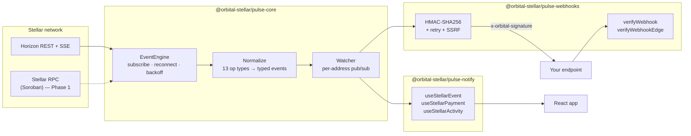

# Orbital

[](LICENSE)
[](https://github.com/determined-001/orbital_stellar/actions/workflows/ci.yml)
[](https://github.com/determined-001/orbital_stellar/actions/workflows/codeql.yml)
[](tsconfig.base.json)
[](.github/workflows/ci.yml)
[](https://www.conventionalcommits.org)

> **Status**: Phase 0 — Foundation &nbsp;·&nbsp; **Networks**: testnet + mainnet &nbsp;·&nbsp; **License**: MIT

**Stellar's biggest developer-experience gap isn't a missing API — it's that Horizon's firehose still requires every team to build their own event delivery.**

Orbital ships that delivery layer once, openly: a typed event engine that normalizes Horizon output into application-shaped events, HMAC-signed webhook delivery with retry and edge-runtime verification, a shared ABI registry for Soroban schemas, and React hooks for live data in the browser. Four MIT-licensed packages, designed to be composed.

---

## Table of contents

- [Why this exists](#why-this-exists)
- [Packages](#packages)
- [Quickstart](#quickstart)
- [Architecture](#architecture)
- [Documentation](#documentation)
- [Production hosting](#production-hosting)
- [Roadmap](#roadmap)
- [Contributing](#contributing)
- [Contributors](#contributors)
- [License](#license)

---

## Why this exists

Stellar's official APIs give you the raw firehose — and not much else:

- **Horizon SSE** drops on idle, requires backoff, and surfaces raw operations rather than application-friendly events.
- **Stellar RPC** keeps only ~7 days of Soroban history and has no native subscription model.
- **Webhooks** aren't part of the platform — every project rebuilds HMAC signing, retry, SSRF guards, and edge-runtime verification from scratch.
- **React integration** doesn't exist — every dashboard rebuilds SSE plumbing and lifecycle management.

Every serious Stellar app — wallet, dashboard, anchor integration, agent — re-solves the same problem. Orbital ships those primitives once so you can `pnpm add` them instead of rebuilding them.

The longer-form thesis, the multi-year vision, and the SCF grant case live in [`PROGRESS.md`](PROGRESS.md), [`ROADMAP.md`](ROADMAP.md), and `docs/proposal.md` (in progress).

---

## Packages

| Package | Description | Status |
|---|---|---|
| [`@orbital-stellar/pulse-core`](./packages/pulse-core) | EventEngine — Horizon subscription, normalization, reconnection, rate-limit handling | ✅ Phase 0 |
| [`@orbital-stellar/pulse-webhooks`](./packages/pulse-webhooks) | HMAC-signed webhook delivery + verification (Node + edge runtimes) | ✅ Phase 0 |
| [`@orbital-stellar/pulse-notify`](./packages/pulse-notify) | React hooks — `useStellarEvent`, `useStellarPayment`, `useStellarActivity` | ✅ Phase 0 |
| [`@orbital-stellar/abi-registry`](./packages/abi-registry) | Canonical Soroban ABI client, schema helpers, and registry publisher interface | ✅ Phase 1 |

> The full classic-operation taxonomy is shipped (payments, account create/merge/options/bump-sequence, trustlines + auth, offers, claimables, liquidity pools, manage-data). Soroban contract events are Phase 1 (Q2–Q3 2026) — see [`ROADMAP.md`](ROADMAP.md).

---

## Quickstart

> _Packages publish to npm at `v0.1.0` (Phase 0 milestone). Until then, clone the repo and use the workspace install below._

```bash
git clone https://github.com/determined-001/orbital_stellar.git
cd orbital_stellar
pnpm install
```

Once published, install only what you need:

```bash
pnpm add @orbital-stellar/pulse-core             # always
pnpm add @orbital-stellar/pulse-webhooks         # if you push events to HTTPS endpoints
pnpm add @orbital-stellar/pulse-notify react     # if you render live events in React
```

### Subscribe to events directly

```ts
import { EventEngine } from "@orbital-stellar/pulse-core";

const engine = new EventEngine({ network: "testnet" });
engine.start();

const watcher = engine.subscribe("GABC...YOUR_ACCOUNT");

watcher.on("payment.received", (event) => {
  console.log(`+${event.amount} ${event.asset} from ${event.from}`);
});

watcher.on("*", (event) => {
  // Every event for this address, regardless of type
});
```

### Deliver events to a webhook

```ts
import { EventEngine } from "@orbital-stellar/pulse-core";
import { WebhookDelivery } from "@orbital-stellar/pulse-webhooks";

const engine = new EventEngine({ network: "mainnet" });
engine.start();

const watcher = engine.subscribe("GABC...");

new WebhookDelivery(watcher, {
  url: "https://your-app.com/hooks/stellar",
  secret: process.env.WEBHOOK_SECRET!,
  retries: 3,
});
```

Receivers verify the signature with `verifyWebhook` (Node) or `verifyWebhookEdge` (Cloudflare Workers / Vercel Edge / Deno / browsers).

### Render live events in React

```tsx
"use client";
import { useStellarPayment } from "@orbital-stellar/pulse-notify";

export function IncomingPayments({ address }: { address: string }) {
  const { event, connected } = useStellarPayment(
    process.env.NEXT_PUBLIC_ORBITAL_URL!,
    address,
  );
  if (!connected) return <p>Connecting…</p>;
  if (!event) return <p>No payments yet.</p>;
  return <p>+{event.amount} {event.asset} from {event.from.slice(0, 8)}…</p>;
}
```

Run it against testnet, send a test payment from the [Stellar Laboratory](https://laboratory.stellar.org), and you'll see the event print within seconds. The full guide lives at [`apps/web/content/getting-started/quick-start.md`](apps/web/content/getting-started/quick-start.md).

---

## Architecture



The reference composition — a Next.js route handler that subscribes to an address and streams events as SSE, plus an HMAC-signing route for the on-page webhook demo — lives in [`apps/web/app/api`](apps/web/app/api).

---

## Documentation

| Document | What it covers |
|---|---|
| [`PROGRESS.md`](PROGRESS.md) | Phase 0 completion status, project structure, architecture overview |
| [`ROADMAP.md`](ROADMAP.md) | Multi-year vision (Phase 0 → Phase 4), Soroban + cursor persistence + replay store |
| [`CHANGELOG.md`](CHANGELOG.md) | Release notes (top-level; per-package changelogs roll up) |
| [`CONTRIBUTING.md`](CONTRIBUTING.md) | Setup, coding standards, PR process, Drips Wave Program |
| [`SECURITY.md`](SECURITY.md) | Vulnerability disclosure policy |
| [`packages/pulse-core/README.md`](packages/pulse-core/README.md) | EventEngine API, event taxonomy, configuration |
| [`packages/pulse-webhooks/README.md`](packages/pulse-webhooks/README.md) | Delivery contract, verification, SSRF safety |
| [`packages/pulse-notify/README.md`](packages/pulse-notify/README.md) | React hooks, type narrowing, authentication |
| [`packages/abi-registry/README.md`](packages/abi-registry/README.md) | ABI Registry client, publisher interface, and shared schema helpers |
| [`apps/web/README.md`](apps/web/README.md) | Marketing site + sandboxed demo API routes |

---

## Production hosting

Two paths:

1. **Build your own backend** — install the SDKs, wire them into your existing Node.js or edge worker, deploy on the infrastructure you already operate. The Next.js route handlers in [`apps/web/app/api`](apps/web/app/api) are a copy-paste reference.
2. **Use Orbital Cloud (in development)** — managed runtime handling multi-region orchestration, persistent webhook registries, replay, and observability. Out of scope for this repository.

---

## Roadmap

- **Now (Phase 0)** — Full classic operation taxonomy, edge-runtime webhook verification, React hooks ✅
- **Q2–Q3 2026 (Phase 1, `v1.0`)** — Soroban event subscription, ABI registry client, cursor persistence, replay adapters, npm publish, stability pledge
- **2027 (Phase 2)** — `@orbital-stellar/hooks`, `@orbital-stellar/payments`, `@orbital-stellar/auth`, first SEP submission
- **2028+ (Phase 3)** — `@orbital-stellar/x402`, `@orbital-stellar/agent-sdk`, intent compiler

Full multi-year plan in [`ROADMAP.md`](ROADMAP.md).

---

## Contributing

Contributions are welcome from the Stellar community. Start here:

- Read [`CONTRIBUTING.md`](CONTRIBUTING.md) for the dev loop, coding standards, and PR process.
- Browse [issues tagged `good-first-issue`](https://github.com/determined-001/orbital_stellar/labels/good-first-issue) — scoped, unblocked, reviewer-ready.
- Stellar Wave Program issues are tagged `wave-program` and pay per-merge per complexity points.
- Run the test suite before submitting: `pnpm -r typecheck && pnpm test`.

All contributors are expected to follow the [Code of Conduct](CODE_OF_CONDUCT.md) _(in progress)_.

---

## Contributors

Thanks to everyone who has shipped code, docs, or feedback for Orbital. The list below is maintained via the [all-contributors](https://allcontributors.org) bot — see [Adding yourself to the contributors list](CONTRIBUTING.md#adding-yourself-to-the-contributors-list) to add or update your entry.

<!-- ALL-CONTRIBUTORS-LIST:START - Do not remove or modify this section. Update with: npx all-contributors generate -->
<!-- prettier-ignore-start -->
<!-- markdownlint-disable -->
<table>
  <tbody>
    <tr>
      <td align="center" valign="top" width="14.28%"><a href="https://github.com/determined-001"><br /><sub><b>determined-001</b></sub></a><br /><a href="https://github.com/determined-001/orbital_stellar/commits?author=determined-001" title="Code">💻</a> <a href="https://github.com/determined-001/orbital_stellar/commits?author=determined-001" title="Documentation">📖</a> <a href="#infra-determined-001" title="Infrastructure">🏗️</a> <a href="#maintenance-determined-001" title="Maintenance">🚧</a> <a href="#projectManagement-determined-001" title="Project Management">📆</a> <a href="https://github.com/determined-001/orbital_stellar/pulls?q=is%3Apr+reviewed-by%3Adetermined-001" title="Reviewed Pull Requests">👀</a> <a href="https://github.com/determined-001/orbital_stellar/commits?author=determined-001" title="Tests">⚠️</a></td>
      <td align="center" valign="top" width="14.28%"><a href="https://github.com/Trovicdev"><br /><sub><b>Trovicdev</b></sub></a><br /><a href="https://github.com/determined-001/orbital_stellar/commits?author=Trovicdev" title="Code">💻</a></td>
      <td align="center" valign="top" width="14.28%"><a href="https://github.com/Praxhant97"><br /><sub><b>Praxhant97</b></sub></a><br /><a href="https://github.com/determined-001/orbital_stellar/commits?author=Praxhant97" title="Code">💻</a></td>
      <td align="center" valign="top" width="14.28%"><a href="https://github.com/Chrisbankz0"><br /><sub><b>Christopher Umechukwu</b></sub></a><br /><a href="https://github.com/determined-001/orbital_stellar/commits?author=Chrisbankz0" title="Code">💻</a></td>
      <td align="center" valign="top" width="14.28%"><a href="https://github.com/3m1n3nc3"><br /><sub><b>Legacy</b></sub></a><br /><a href="https://github.com/determined-001/orbital_stellar/commits?author=3m1n3nc3" title="Code">💻</a></td>
    </tr>
  </tbody>
</table>
<!-- markdownlint-restore -->
<!-- prettier-ignore-end -->
<!-- ALL-CONTRIBUTORS-LIST:END -->

Emoji key follows the [all-contributors](https://allcontributors.org/docs/en/emoji-key) spec — 💻 code · 📖 docs · 🎨 design · 🏗️ infrastructure · 🚧 maintenance · 📆 project management · 👀 reviewed PRs · ⚠️ tests.

The list above is the curated **all-contributors** set. For the full commit history including every contributor not yet recognized here, see [GitHub's contributor graph](https://github.com/determined-001/orbital_stellar/graphs/contributors) — if your name is there and not in the table, please [open an issue](https://github.com/determined-001/orbital_stellar/issues/new) or comment `@all-contributors please add @your-username for code` on any issue and the bot will add you.

---

## License

[MIT](LICENSE) — free to use in commercial and open-source projects.

---

## Community

- GitHub Discussions: _(enable via repo settings — see Drips funding plan)_
- Twitter: _(handle pending)_
- Discord: _(invite pending)_
